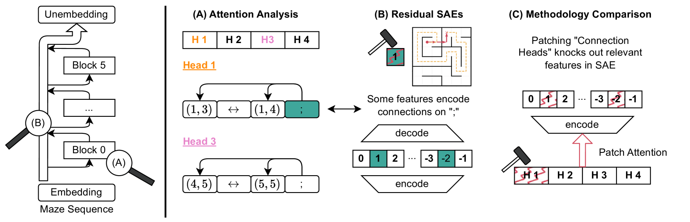
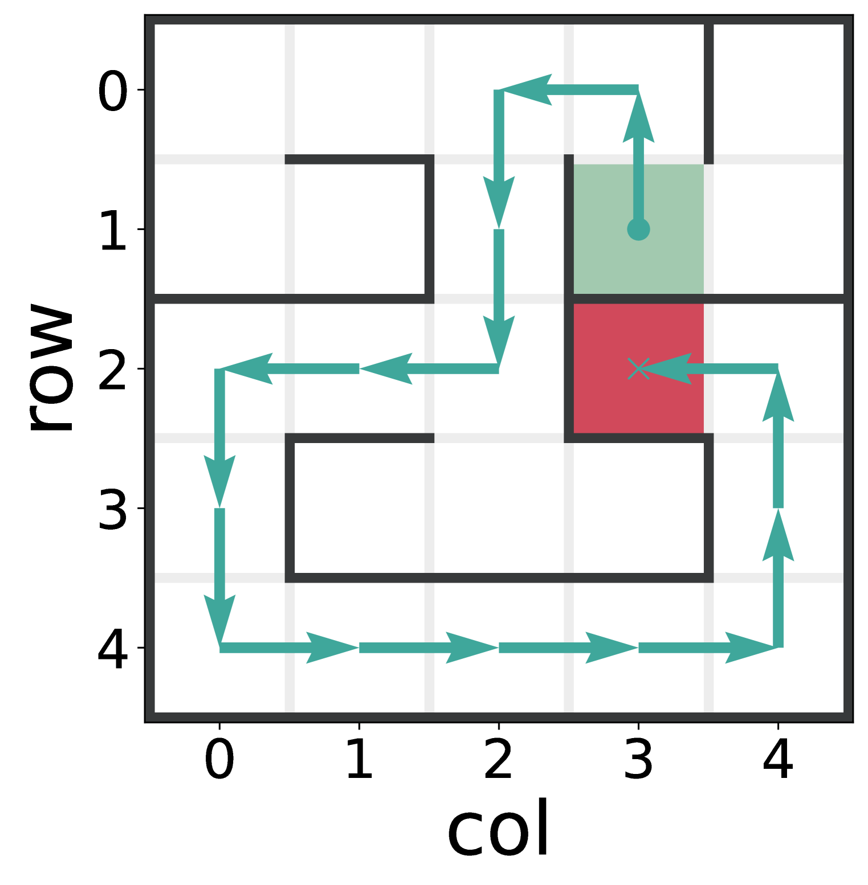

+++
title = "Transformers Use Causal World Models in Maze-Solving Tasks"
description = "Using sparse autoencoders and attention analysis, we discover and intervene on world models in maze-solving transformers"
date = "2024-03-14"
thumbnail = ""
categories = [
  "demo"
]
draft = "false"
tags = []

vega = true

[distill]
  [distill.supportFiles]
  dtitle = "hi"
  appendix = "appendix.html"
  bibliography = "refs.bib"

[[distill.authors]]
author = "Alex F. Spies¹, William Edwards¹, Michael Ivanitskiy², Adrians Skapars³, Tilman Räuker, Katsumi Inoue⁴, Alessandra Russo¹, Murray Shanahan¹"
affiliations = [
  { name = "¹Imperial College London", url = "" },
  { name = "²Colorado School of Mines", url = "" },
  { name = "³University of Manchester", url = "" },
  { name = "⁴National Institute of Informatics", url = "" }
]

+++

<d-abstract class="abstract">
  
Recent studies in interpretability have explored the inner workings of transformer models trained on tasks across various domains, often discovering that these networks naturally develop surprisingly structured representations. When such representations comprehensively reflect the task domain's structure, they are commonly referred to as "World Models" (WMs). In this work, we discover such WMs in transformers trained on maze tasks. In particular, by employing Sparse Autoencoders (SAEs) and analysing attention patterns, we examine the construction of WMs and demonstrate consistency between the circuit analysis and the SAE feature-based analysis. We intervene upon the isolated features to confirm their causal role and, in doing so, find asymmetries between certain types of interventions. Surprisingly, we find that models are able to reason with respect to a greater number of active features than they see during training, even if attempting to specify these in the input token sequence would lead the model to fail. Furthermore, we observe that varying positional encodings can alter how WMs are encoded in a model's residual stream.

</d-abstract>

## Motivation
In our [first paper](https://arxiv.org/abs/2312.02566) we trained transformers to solve mazes and used linear probing to show that they formed internal representations of entire mazes within single tokens. Whilst we uncovered interesting dynamics in the learning of these representations vs. performance, we were unable to causally intervene upon them to consistently effect the behaviour of our models. In our [second paper](https://arxiv.org/abs/2412.11867), we use sparse autoencoders to discover features that capture the maze structure and can actually be causally intervened upon to effect the behaviour of our models.

## What is a World Model?

<d-figure style="grid-column: page;">
  

    
    
Overview of our methodology for discovering and validating world models in transformer-based maze solvers. (A) We analyze attention patterns in early layers, finding heads that consolidate maze connectivity information at semicolon tokens. (B) We train sparse autoencoders on the residual stream immediately following the first block, identifying interpretable features that encode maze connectivity. (C) We demonstrate the causal role of the world models in our transformers comparing the features extracted through both methods and validating them through causal interventions

  

</d-figure>

## Our Setting

  

    
    
An example of a tokenized maze. 1: The adjacency list describes the connectivity of the maze, with the semicolon token ; delimiting consecutive connections. The order of connections is randomized, ellipses represent omitted connection pairs. 2,3: The origin and target specify where the path should begin and end, respectively. 4: The path itself a sequence of coordinate tokens representing the shortest path from the origin to the target. For a "rollout," we provide everything up to (and including) the <PATH START> token and autoregressively sample with argmax until a <PATH END> token is produced.

  

  

    
    
Visual representation of the same maze as in the tokenized representation on the left. The origin is indicated in green, the target in red, and the path in blue.

  

